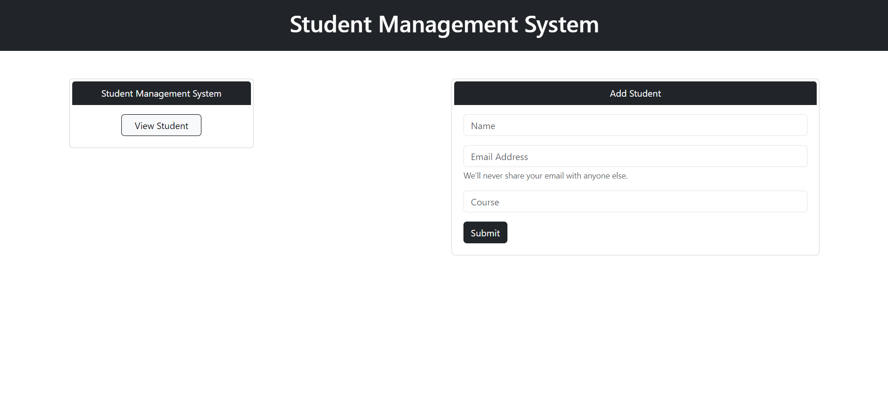
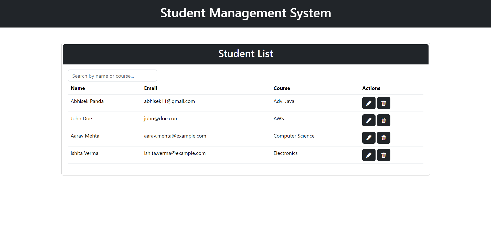

<h1 align="center">🎓 Student Management System</h1>
<p align="center">
  A full stack CRUD application built using Spring Boot, JPA, HTML, CSS, and JavaScript.
</p>

<p align="center">
  
  
  
  
</p>

---

## 🧩 Overview

This is a Student Management System that performs full **CRUD operations** via a Spring Boot REST API. The frontend is built with plain HTML, CSS, and JavaScript. It includes real-time form validation, dynamic UI updates, and client-side search functionality.

---

## 🚀 Features

- ✅ Add new students via form
- ✅ View all students in a table
- ✅ Edit student information
- ✅ Delete individual student records
- ✅ Search/filter students by name or course
- ✅ Client-side and server-side form validation

---

## 🛠 Tech Stack
```
| Layer       | Tech                              |
|------------|------------------------------------|
| Backend     | Spring Boot, Spring Data JPA, Hibernate |
| Frontend    | HTML, CSS, JavaScript             |
| Database    | MySQL / H2 (optional)             |
| Build Tool  | Maven                             |
| IDE         | Spring Tool Suite (STS)           |
```
---

## 📁 Project Structure

```
src
├── main
│   ├── java
│   │   └── com.panda.studentmanagement
│   │       ├── controller
│   │       ├── model
│   │       ├── repository
│   │       ├── service
│   │       └── StudentManagementApplication.java
│   └── resources
│       ├── static/ ← HTML, JS, CSS
│       └── application.properties
````
---

## 🔧 How to Run

1. **Clone the repo**
```bash
git clone https://github.com/Panda-Abhisek/student-management-system.git
cd student-management-system
```

2. **Configure your database**

In `src/main/resources/application.properties`:

```properties
spring.datasource.url=jdbc:mysql://localhost:3306/student_db
spring.datasource.username=your_username
spring.datasource.password=your_password
spring.jpa.hibernate.ddl-auto=update
```

> ✅ You can also use H2 in-memory DB for testing.

3. **Run the app**

```bash
./mvnw spring-boot:run
```

Or directly from STS or IntelliJ.

4. **Access the UI**

```markdown
| Page          | URL                                    |
| ------------- | -------------------------------------- |
| Home          | `http://localhost:8080/home.html`      |
| Add Student   | `http://localhost:8080/index.html`     |
| View Students | `http://localhost:8080/students.html`  |
| Edit Student  | `http://localhost:8080/edit.html?id=1` |
```

---

## 🧪 API Endpoints
```
| Method | Endpoint             | Description          |
| ------ | -------------------- | -------------------- |
| GET    | `/api/students`      | Get all students     |
| GET    | `/api/students/{id}` | Get a student by ID  |
| POST   | `/api/students`      | Create a new student |
| PUT    | `/api/students/{id}` | Update a student     |
| DELETE | `/api/students/{id}` | Delete a student     |
```
---

## 💻 Screenshots

```markdown



```

---

## 🧠 What I Learned

* Building RESTful APIs using Spring Boot
* Integrating frontend JS with backend APIs
* Using JPA & Hibernate with MySQL
* Frontend validation and live filtering
* Structuring clean full stack Java projects

---

## 📫 Contact

**Abhisek Panda**
🔗 [LinkedIn](https://www.linkedin.com/in/abhisek-panda-)

---

## 🪪 License

This project is open-source and available under the [MIT License](LICENSE).

---